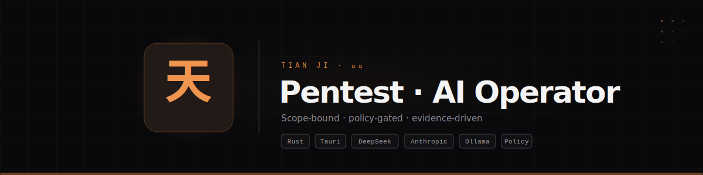

<div align="center">



# Tiān Jī (天机)

**AI-piloted pentesting operator.**  
Scope-bound, policy-gated, evidence-driven.

[](https://www.rust-lang.org)
[](https://v2.tauri.app)
[](https://react.dev)
[](LICENSE)

[**Architecture**](#architecture) · [**Quick Start**](#quick-start) · [**Providers**](#providers) · [**Safety**](#safety) · [**Token Economy**](#token-economy)

</div>

---

## Overview

Tiān Jī is a **Tauri 2 desktop app** that puts an LLM agent behind the terminal for authorized penetration testing. You talk to the agent; it proposes shell commands, routes them through a pure Rust policy engine, and only touches a real terminal after tiered human approval — or, in autonomous mode, after scope verification.

It is not a chatbot. It is not a scanner wrapper. It is a **terminal-native operator** — the agent runs `nmap`, `curl`, `gobuster`, `sqlmap`, `hydra`, and every other tool on your machine, while the policy engine ensures it never leaves scope.

Three operating modes:

| Mode | Behaviour |
|---|---|
| **Default** | Every mutating command waits for explicit approval |
| **⚡ Auto** | In-scope commands auto-execute; out-of-scope / denies still block |
| **☢ Free** | All policy checks bypassed — lab / trusted environments only |

---

## Features

### Multi-provider agent

| Provider | Models | Auth |
|---|---|---|
| **DeepSeek** | `deepseek-v4-pro`, `deepseek-v4-flash`, `deepseek-chat`, `deepseek-reasoner` | API key |
| **Anthropic** | `claude-opus-4-8`, `claude-sonnet-4-6`, `claude-haiku-4-5` | API key or OAuth (Claude Pro/Max) |
| **Ollama** (local) | Any pulled model | None |

DeepSeek models speak the **Anthropic Messages API** natively via `api.deepseek.com/anthropic` — same wire format as Claude. No translation layer. Provider-aware prompt generation adapts reasoning and delegation style per model.

### Policy engine — the safety spine

Every command passes through `tianji-policy`:

```
LLM proposes command → resolve_targets() → classify() → decide() → Auto-run / Park / Deny
```

The LLM **never** classifies its own risk. Unknown commands fail closed to human approval.

### Agent tools

| Tool | Purpose |
|---|---|
| `run_command` | Execute system tools — `nmap`, `curl`, `gobuster`, `hydra`, custom scripts |
| `use_skill` | Load proven CTF playbooks (ctf-web, ctf-pwn, etc.) — two-level disclosure |
| `delegate_to_agent` | Spawn recon / web / exploit sub-agents with isolated context |
| `record_finding` | Capture flags, shells, creds, confirmed vulns |
| `log_attempt` | Trace every approach — never repeat a dead end |
| `recall` | Fetch full output truncated from context |

### Durable engagement state

Every event — prompts, responses, tool calls, output, findings — is written to an append-only per-workspace SQLite log. Restart the app, switch workspaces, come back days later: the engagement is there.

### Token economy

| Layer | Mechanism |
|---|---|
| Prompt caching | Stable system prefix cached at ~10% input cost from turn 2 |
| Rolling compaction | Old turns summarised on a cheaper model |
| Tool output cap | Large output truncated; raw retrievable via `recall` |
| Command dedup | Identical read-only commands reuse cached output |
| Cost meter | Cumulative spend per workspace; hard budget cap |
| Goal safeguards | Autonomous runs self-stop at 15 iterations or ~600k tokens |

Rough cost: an autonomous HTB box is **~250k–600k metered tokens ≈ $2–6 on Claude Opus**, less on DeepSeek.

---

## Architecture

```
crates/
  tianji-types/     Shared domain types (leaf crate)
  tianji-policy/    Policy engine — pure, no I/O (the safety spine)
  tianji-store/     Append-only SQLite event log + read-models
  tianji-pty/       PTY manager (portable-pty)
  tianji-llm/       LlmProvider trait + Claude + DeepSeek + Ollama adapters
  tianji-agent/     Orchestrator, MCP host, context assembler, skills, runner
src-tauri/          Desktop binary — IPC glue only
src/                Web frontend (Vite + React + Tailwind)
```

Dependencies point inward toward `tianji-types`. Nothing depends on `src-tauri`.

### The turn loop

```
Operator prompt
    → Load scope / rules / phase / notes / attempts / findings
    → Rebuild system prompt: stable (cached) + volatile (uncached)
    → Maybe compact old history via sub-agent summarisation
    → Up to 8 model rounds: assemble → trim → provider.run_turn() →
      for each tool call: policy check → execute / park / deny → feed results back
    → Persist to session history + workspace DB
```

---

## Quick Start

### Prerequisites

| Requirement | Version |
|---|---|
| Node.js | ≥ 20 |
| Rust | stable ≥ 1.77 |
| System libs | WebKitGTK 4.1, D-Bus (Linux only) |

### Linux dependencies

```bash
# Ubuntu 22.04+ / Debian 12+
sudo apt-get install -y build-essential pkg-config libssl-dev \
  libwebkit2gtk-4.1-dev libayatana-appindicator3-dev librsvg2-dev \
  libdbus-1-dev libglib2.0-dev libgtk-3-dev
```

### Build & run

```bash
git clone https://github.com/heavenssealer/Tian-Ji.git
cd Tian-Ji
npm install
npm run tauri dev          # hot-reload
npm run tauri build        # production → src-tauri/target/release/bundle/
```

### Verify without a desktop

```bash
npx tsc --noEmit && npm run build && cargo test --workspace && cargo check --workspace
```

---

## Providers

### DeepSeek (recommended)

Tiān Jī uses DeepSeek's **Anthropic Messages API** endpoint — the same wire format Claude uses. No OpenAI↔Anthropic translation. The Claude-tuned prompt, tools, and SSE streaming all work natively.

1. Get an API key at [platform.deepseek.com](https://platform.deepseek.com)
2. Paste it in Settings → DeepSeek API key
3. Select a `deepseek-*` model

### Anthropic

1. API key at [console.anthropic.com](https://console.anthropic.com), or
2. Connect your Claude Pro/Max subscription via OAuth (Settings)

### Ollama (local, offline)

1. `ollama pull <model>` then select `ollama:<model>` — no key required.

---

## Safety

- **Scope enforcement**: real arguments parsed for IPs, hostnames, URLs, CIDRs
- **Classification**: ReadOnly / Mutating / DangerousFlags — fails closed
- **Tiered approval**: ReadOnly auto-runs; Mutating needs approval
- **Secrets**: API keys, sudo password, OAuth tokens live in OS keychain only

---

## Contributing

The policy crate is pure and exhaustively tested. Run `cargo test -p tianji-policy` after any scope/classification change. Orchestrator tests use a scripted provider and stub runner.

See [`CLAUDE.md`](./CLAUDE.md) for the codebase guide and [`DESIGN.md`](./DESIGN.md) for architectural rationale.

---

## License

MIT — see [LICENSE](LICENSE).

<div align="center">
<sub>Built for authorized security work. Use only on systems you own, labs, CTFs, or targets where you have permission to test.</sub>
</div>
